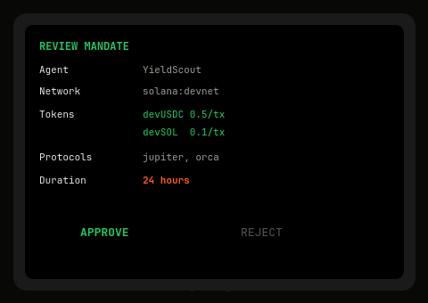

# ostium

**Hardware-signed mandates for AI agents — permission without keys.**

AI agents should not hold private keys. They should hold hardware-signed, time-bound, limit-enforced mandates that define exactly what they're allowed to do — and nothing more.

Built with the [Ledger Agent Stack](https://github.com/LedgerHQ/agent-skills): DMK + Wallet CLI + Speculos.



---

## How ostium enables AI trading on Solana testnet

```
YOU (with Ledger device holding testnet SOL)
  │
  ├─ Create mandate: devUSDC (0.5/tx, 5/day), devSOL (0.1/tx, 1/day)
  │  ├─ Mandate appears on Ledger screen
  │  ├─ You press APPROVE
  │  └─ Ledger cryptographically signs the mandate
  │
  ▼
AI TRADING AGENT (e.g. YieldScout)
  │
  ├─ Runs autonomous trading strategy on Solana devnet
  ├─ Finds arbitrage: buy devSOL on Orca, sell on Jupiter
  ├─ Proposes tx: swap 6 devUSDC for devSOL via Jupiter
  │
  ▼
OSTIUM MIDDLEWARE (mandate enforcement)
  │
  ├─ Token check:  devUSDC ✓ (in mandate)
  ├─ Amount check: 6 > 0.5  ✗ BLOCKED — exceeds per-tx limit
  │  └─ Logged to audit trail. Agent never reaches the device.
  │
  ├─ Agent re-tries with 0.3 devUSDC
  ├─ Token check ✓ · Amount check ✓ · Protocol check ✓
  │  └─ ✓ APPROVED — forwarded to Ledger device
  │
  ▼
LEDGER DEVICE (final signing)
  │
  ├─ Tx appears on hardware screen
  ├─ You review: "Swap 0.3 devUSDC → SOL on Jupiter"
  └─ You press buttons to sign → tx broadcasts to devnet
```

**Without ostium:** agent holds your key. No limits. Gone rogue = drained.

**With ostium:** agent holds a mandate hash. Every tx gated by hardware-enforced limits. You physically sign only approved transactions.

---

## Architecture

```
src/
├── mandate.ts     — Mandate schema, SHA-256 hashing, creation, validation
├── middleware.ts   — Enforcement engine, spend tracking, audit log
├── agent.ts        — Agent SDK, credential creation, action proposal
├── wallet-cli.ts   — Wallet CLI integration, device connection, signing flow
├── server.ts       — Express API server + 8 endpoints
└── cli.ts          — CLI commands + live demo

web/src/
├── pages/
│   ├── Home.tsx         — Hero, How It Works, Connect Ledger, Live Demo w/ CLI proof
│   ├── Dashboard.tsx    — Active mandates + create form
│   ├── Test.tsx         — Proposal tester with mandate selector dropdown
│   └── Audit.tsx        — Full execution log table
└── components/
    ├── Layout.tsx         — Navigation bar + footer
    ├── CreateMandate.tsx  — Mandate creation form
    ├── ProposalTester.tsx — Transaction proposal with device screen mockup
    ├── MandateDashboard.tsx — Live mandate cards with progress bars
    └── ExecutionLog.tsx   — Audit log table with pass/fail rows
```

## Live Demo

**[ostium-pum.vercel.app](https://ostium-pum.vercel.app)**

## Quickstart

```bash
# Clone and install
git clone git@github.com:subheeksh5599/ostium.git
cd ostium && npm install && cd web && npm install && cd ..

# Start backend API
npm run server

# Start React frontend (separate terminal)
cd web && npm run dev
```

Open **https://ledger-mandate.vercel.app** (live deployment) or **http://localhost:3000** (local).

### Real testnet token trading setup

```bash
# 1. Install Speculos emulator
pip install speculos

# 2. Download Solana app for the emulator
curl -L https://github.com/LedgerHQ/app-solana/releases/download/v1.5.0/app.elf -o /tmp/solana.elf

# 3. Start the emulator
speculos --model nanosp --display headless --api-port 5000 /tmp/solana.elf

# 4. In another terminal, connect Wallet CLI to the emulator
export SPECULOS_API=http://localhost:5000
wallet-cli account discover solana:devnet

# 5. Fund the devnet account
solana airdrop 2 <YOUR_ADDRESS> --url devnet

# 6. Now use ostium to create mandates and let your AI agent trade
```

### Create a mandate via CLI

```bash
npm run dev -- create \
  --agent-id YieldScout \
  --tokens "devUSDC:0.5:5,devSOL:0.1:1" \
  --protocols "jupiter,orca" \
  --duration 24 --sign
```

## API

| Method | Path | Description |
|---|---|---|
| `GET` | `/api/status` | Wallet CLI version + available commands |
| `GET` | `/api/connect` | Scan for Ledger device / Speculos emulator |
| `GET` | `/api/cli-proof` | Real Wallet CLI output (help + dry-run) |
| `GET` | `/api/cli-demo` | Full signing flow walkthrough |
| `POST` | `/api/demo` | Run 6-scenario mandate enforcement demo |
| `GET` | `/api/mandates` | List all mandates |
| `POST` | `/api/mandates/create` | Create & sign a mandate |
| `POST` | `/api/propose` | Test a transaction against a mandate |
| `GET` | `/api/audit` | Execution audit log |

## Demo

```
$ npm run demo

  ostium — Mandate Enforcement Tests

  Mandate: 75da6b2154a55847

  PASS  Allowed: 0.3 devUSDC via Jupiter
  PASS  Blocked: 2 devUSDC exceeds per-tx limit (0.5)
  PASS  Blocked: Protocol 'raydium' not in mandate
  PASS  Blocked: Token 'bonk' not in mandate
  PASS  Allowed: 0.05 devSOL via Orca
  PASS  Allowed: simple transfer, no protocol check

  6 passed, 0 failed
```

## Enforcement checks (per transaction)

| Check | Description |
|---|---|
| Token allowed? | Is the token ticker in the mandate's allowlist? |
| Per-tx limit? | Does the amount stay within the per-transaction cap? |
| Protocol allowed? | Is the target protocol in the mandate? |
| Daily cap? | Has the cumulative daily limit been exceeded? |
| Mandate expired? | Is the mandate still within its time window? |

## Why This Matters

| Current state | With ostium |
|---|---|
| Agent holds private key in memory | Agent holds mandate credential (key-less) |
| No spending limits at protocol level | Per-tx, per-token, daily limits enforced by hardware |
| Any protocol, any token | Mandate allowlist enforced before signing |
| Permanent access | Time-bound, human-revokable |
| Compromise = everything lost | Compromise = blocked at mandate level |

## Built with the Ledger Agent Stack

- **DMK Skills** — SDK for agent-device communication
- **Wallet CLI** — Transaction assembly, dry-run, and hardware signing
- **Speculos** — Open-source Ledger device emulator (no physical device required)

## License

MIT
